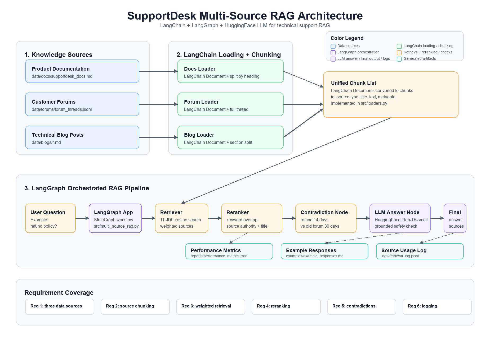

# Multi-Source RAG for Technical Support

A simple multi-source RAG system for answering technical support questions about a fictional product called **SupportDesk**.

The system retrieves information from three sources: product documentation, customer forum threads, and technical blog posts.

## Requirements Covered

| Requirement | Where It Is Implemented |
|---|---|
| Three data sources | `data/docs`, `data/forums`, `data/blogs` |
| Source-specific chunking | `src/loaders.py` |
| Weighted multi-source retrieval | `src/retriever.py` |
| Reranking | `src/reranker.py` |
| Contradiction handling | `src/contradictions.py` |
| Source logging | `src/rag_logger.py` |
| Report | `reports/SupportDesk_Multi_Source_RAG_Report.pdf` |
| Performance analysis | `evaluate.py`, `reports/performance_metrics.json` |
| Example queries and responses | `examples/example_responses.md` |

## Project Structure

```text
data/        Documentation, forum, and blog source files
src/         RAG pipeline implementation
examples/    Example queries and generated responses
reports/     Report, diagram, and performance metrics
tests/       Unit tests
```

## Architecture Diagram



## Setup

```bash
python3 -m venv .venv
.venv/bin/pip install -r requirements.txt
```

## Run The RAG System

```bash
.venv/bin/python -m src.multi_source_rag "What is the refund policy?"
```

Example contradiction query:

```bash
.venv/bin/python -m src.multi_source_rag "A forum says refunds are 30 days. Which refund period is correct?"
```

## Generate Example Responses

```bash
.venv/bin/python run_examples.py
```

Output:

```text
examples/example_responses.md
```

## Run Performance Evaluation

```bash
.venv/bin/python evaluate.py
```

Output:

```text
reports/performance_metrics.json
```

## Run Tests

```bash
.venv/bin/python -m unittest discover -s tests -p 'test_*unittest.py'
```

## Logging

Each response is logged automatically when the RAG system runs.

```text
logs/retrieval_log.jsonl
```

The log stores the question, answer, sources used, scores, and contradiction notes.

Code Walk through Video Link: https://drive.google.com/file/d/1a-zUrMz5Ee2catlSJa1cVoInBbcWvY7X/view?usp=drive_link
